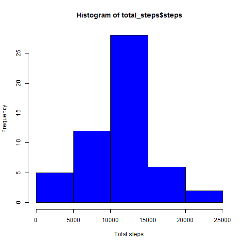
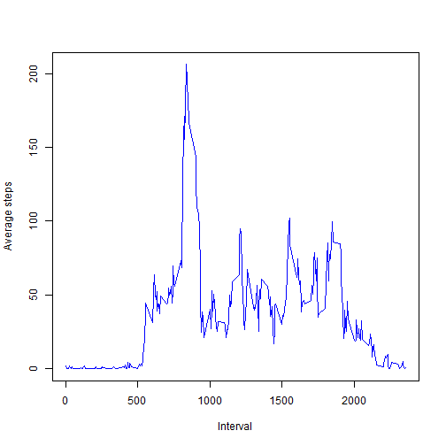
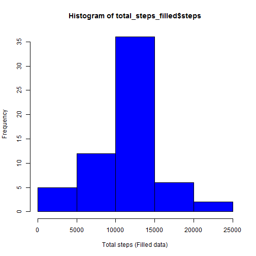

## Loading and preprocessing the data

```r
my_data <- read.csv("activity.csv")
```


## What is mean total number of steps taken per day?

```r
total_steps <- aggregate(steps ~ date,data = my_data, FUN = sum, na.rm = TRUE)
hist(total_steps$steps, xlab = "Total steps", col = "blue")
```

 

```r
mean_steps <- as.integer(mean(total_steps$steps))
median_steps <- as.integer(median(total_steps$steps))
```
The mean of the total number of steps taken per day is **10766**.  
The median of the total number of steps taken per day is **10765**.

## What is the average daily activity pattern?

```r
average_steps <- aggregate(steps ~ interval ,data = my_data, FUN = mean, na.rm = TRUE)
plot(average_steps$interval, average_steps$steps, type = "l", 
     xlab = "Interval", ylab = "Average steps", col = "blue")
```

 

```r
max_average_steps <- as.integer(max(average_steps$steps))
max_steps_interval <- average_steps$interval[which.max(average_steps$steps)]
```
The 5-minute interval from **835**, on average across all the days in the dataset, contains the maximum number of steps.

## Imputing missing values

```r
na_count <- sum(is.na(my_data$steps))
```
The total number of missing values in the dataset is **2304**.  

The missing values is filled in by the mean for that 5-minute interval.

```r
filled_data <- read.csv("activity.csv")
filled_data$steps[is.na(filled_data$steps)] = average_steps$steps
total_steps_filled <- aggregate(steps ~ date, data = filled_data, FUN = sum, na.rm = TRUE)
hist(total_steps_filled$steps, xlab = "Total steps (Filled data)", col = "blue")
```

 

```r
mean_steps_filled <- as.integer(mean(total_steps_filled$steps))
median_steps_filled <- as.integer(median(total_steps_filled$steps))
```
The mean of the total number of steps taken per day (filled data) is **10766**.  
The median of the total number of steps taken per day (filled data) is **10766**.  
The mean is the same while the median increases marginally.  
*As the mean is higher than the median when ignoring the missing data, the filled-in data results in same mean but higher median (closer to the mean).*


## Are there differences in activity patterns between weekdays and weekends?

```r
filled_data$weekday <- weekdays(as.Date(filled_data$date))
filled_data$weekend[filled_data$weekday %in% c("Saturday", "Sunday")] <- "weekend"
filled_data$weekend[is.na(filled_data$weekend)] <- "weekday"
average_steps_filled <- aggregate(steps ~ interval + weekend ,data = filled_data, FUN = mean, na.rm = TRUE)

library(lattice)
xyplot(steps ~ interval | weekend, data = average_steps_filled, type = "l", layout = c(1, 2), xlab = "Interval", ylab = "Number of steps")
```

 
